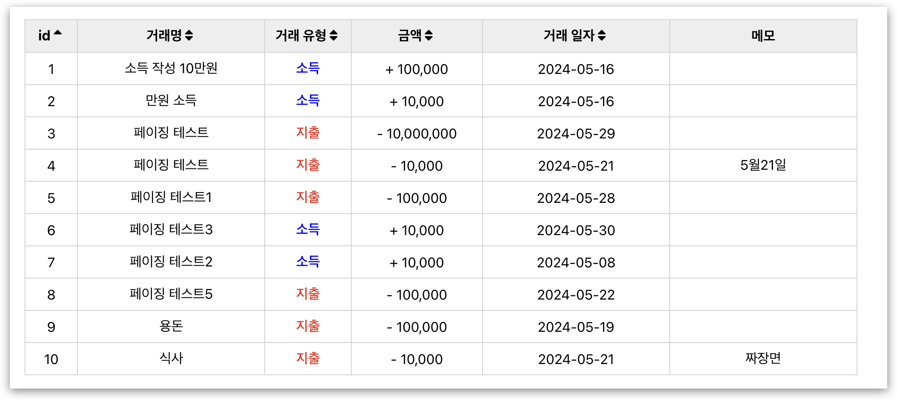

# Account Book project

개인재무관리 서비스는 서비스를 사용하는 사용자의 지출 및 수입 내역을 수집하여 한 눈에 확인할 수 있도록 하여 사용자로 하여금 올바른 소비 계획을 세울 수 있도록 돕는 서비스이다.

[시연 동영상 2024.05.16 버전](https://youtu.be/rP9JDkVVZMk)

# Team

- **20191627 오홍석**

# Feature

  
## 회원 가입

- 

  
이메일 중복 방지 및 유효성 검사

  
  

  

- 

  
비밀번호 유효성 검사

  
  

  

- 

  
입력 정보 공란 확인

  
  

  
  

- 

  
자동 하이픈 삽입 기능

  
  

  
  

- 회원가입 완료시 User Account 생성
- 로그인 화면으로 이동

## 로그인
  

- 

  
잘못된 계정 정보 확인

  
  
  

  

- 

  
페이지 접근 제한 기능 및 Title 클릭시 리다이렉트 기능

  
  
  

  

- 

  
홈페이지 Title 변경

  
  

  

- 

  
이메일, 비밀번호 입력 전 로그인 버튼 비활성화

  
  

  

  

## 프로필 확인
  

- 

  
계정 정보 확인

  
  

  

- 

  
로그아웃

  
  

  

## 거래 내역 등록
  

- 

  
캘린더 커스텀

  
  

  

- 

  
입력 정보 형식 설정 및 검증

  
  - 거래명 20글자 제한, 공백 제외
  - 금액 1억원 미만, 숫자 이외의 문자 입력 방지
  - 간단한 메모 40글자 제한
  
  
  
  
  

  

- 

  
거래 내역 생성 성공

  
  

  

  

## 거래 내역 확인
  

- 

  
조회된 거래 내역의 요약 테이블

  - 총 거래수, 총 지출 수, 총 소득 수
  - 총 지출 금액, 총 소득 금액, 총 합계 금액
    
  

  

- 

  
거래 내역 조회

  
  - 기간에 따른 거래 내역 조회
  - 선택 유형에 따른 거래 내역 조회
  - 시작 날짜가 마감 날짜를 앞서지 못하도록 예외 처리
  - 지출, 소득에 따른 텍스트 색상 강조
  
  
  
  
  
  

  

- 

  
정렬 기능

  - 메모를 제외한 항목으로 모두 오름차순, 내림차순, 기존 순서로 설정이 가능
  - 아래 사진은 id와 금액으로 정렬한 사진
  
  
  

  

- 

  
페이징 기능

  - 거래 내역 10개씩 한 페이지 구성
  - 페이지 이동 불가시 버튼 비활성화
  
  

  

- 

  
초기 화면

  
  

  

## 계좌 연동
  

- 

  
사용자 인증을 통한 계좌 연동

  - 금결원 API 요청을 통한 사용자 인증
  - 사용자 인증 후 발급되는 코드가 없다면 계좌 연동 버튼 비활성화
  - 사용자 인증 후 발급된 코드를 통해서 토큰 발급
  - 발급된 토큰을 해당 계정에 저장
    
  
  
  
  

  

- 

  
사용자 계정에 계좌 연동

  
  - 발급된 토큰을 바탕으로 금결원 거래 내역 조회 API 요청
  - 위의 기능은 금결원 테스트 베드 사용 권한 변경으로 인하여 구현 불가
  - 토큰 저장 기능까지 구현
  
  

  

- 

  
계좌 연동 후 프로필 변경 및 예외 처리

  
  - 계좌 연동 후 프로필 페이지에서 연결된 계좌 수 표현
  - 계좌 연동 후 추가 계좌 연동은 구현하지 않기 때문에 접근 불가 처리
  
  
  

  

# 시스템 구조

# Stacks

**Front-End**  

**Back-End**

# Using Module

### Front-End

- tanstack/react-table
- axios
- moment
- react-calendar
- styled-components

### Back-End

- axios
- cors
- dotenv
- sequelize
- mysql2

# Usage

- **Back-end**

  - node v20.7.0
  - npm 또는 yarn 설치 후 진행
    - `npm install`
    - `yarn install`
  - MySQL(Ver 8.1.0) 설치 및 web_project 데이터베이스 추가
    - MySQL(Ver 8.1.0) 설치
    - `mysql -u root -p` -> 비밀번호 입력
    - `CREATE DATABASE web_project;`
  - backend 최상위 폴더에서 .env 파일 생성
    - `DB_PASSWORD=mysql 비밀번호`
  - 실행
    - `npm start`
    - `yarn start`

- **Front-end**
  - node v20.7.0
  - npm 또는 yarn 설치 후 진행
    - `npm install`
    - `yarn install`
  - 실행
    - `npm start`
    - `yarn start`
